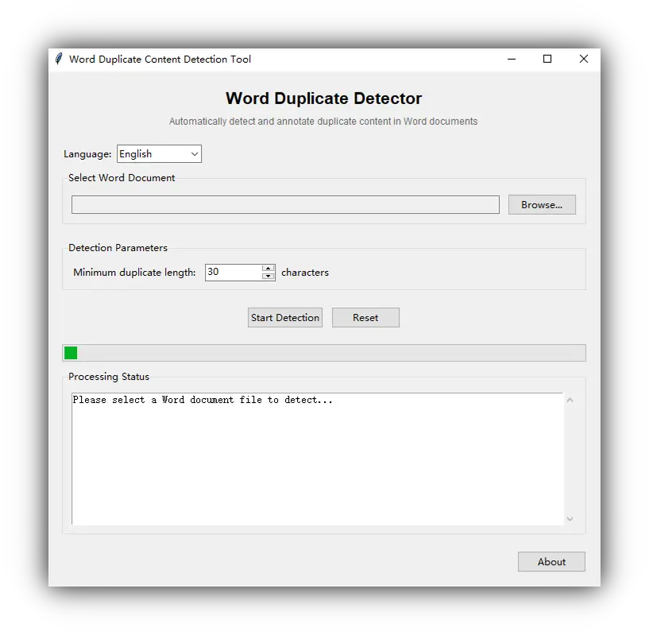

# Word 文档重复内容检测工具

[English](README.md) | [简体中文](README.zh_Hans.md) | [繁體中文](README.zh_Hant.md)

一个用于检测 Word 文档中重复内容并添加智能批注的开源工具, 具有智能分组和精确段落定位等功能.

## ✨ 功能特点

- **🔍 自动检测**: 智能检测 Word 文档中的重复内容;
- **📝 智能批注**: 为重复内容添加批注, 显示重复来源段落号;
- **🔢 智能分组**: 相同内容使用相同编号, 便于识别;
- **🎯 精确定位**: 精确段落定位, 无页码估算误差;
- **⚙️ 可自定义参数**: 支持自定义检测参数 (默认30字符);
- **📄 非破坏性**: 生成带批注的新文档, 原文档不变;
- **💻 免安装**: Portable 运行, 无需安装, 没有额外依赖;
- **🌐 多语言支持**: 支持英语、简体中文、繁体中文;

## 🎮 使用方法

直接从 [Releases](https://github.com/fernvenue/word-duplicate-detector/releases/latest) 下载最新版本运行即可, 无需安装.



1. **选择文档**: 选择要检测的Word文档 (.docx格式);
2. **设置参数**: 设定最小重复长度 (建议20-50字符);
3. **开始检测**: 点击 *开始检测* 按钮;
4. **查看结果**: 检查生成的带批注文档;
5. **浏览重复**: 通过重复编号快速识别重复组;

### 📊 批注格式

工具以以下格式添加批注:

```
重复#1: 与第25段内容重复
```

- **重复#N**: 同一内容的所有重复使用相同编号;
- **第Y段**: 重复内容来源的精确段落编号;

### 🧠 重复编号逻辑

相同的重复内容会被分配相同的编号, 例如: A 段落重复 B 段落, C 段落也重复 B 段落, 则 A 和 C 都会显示相同的重复编号, 便于快速识别哪些段落是同一组重复.

## 🚀 自行构建

需要预先安装 Python 环境.

克隆仓库:

```bash
git clone https://github.com/fernvenue/word-duplicate-detector.git
cd word-duplicate-detector
```

运行构建脚本:

```bash
build.bat
```

## 许可证

本工具以 GPLv3 协议开源, 详情请参考 [LICENSE](./LICENSE).
